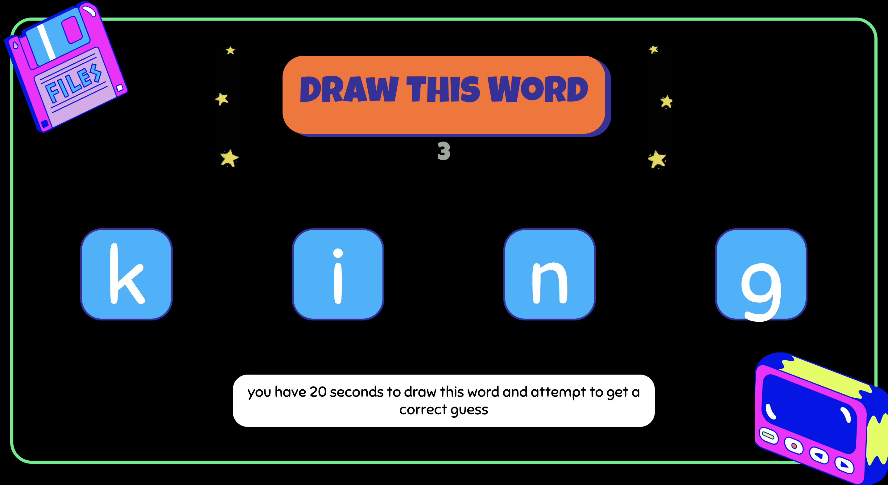

# Presentation
https://www.canva.com/design/DAFlQ4sqGr8/BBrhqQq2MvAnAH-UhpGQEQ/view?utm_content=DAFlQ4sqGr8&utm_campaign=designshare&utm_medium=link&utm_source=publishsharelink

# Deployed Links

deployed frontend link: https://doodledash.netlify.app/ 

# DoodleDash

## Description

We got our concept from a similar game on Discord called Gartic Phone who was promoting for their birthday event. Basing our game on Pictionary and Draw something, we wanted a fun multi-player game you can play with friends to pass the time! 

Select a room, guess or draw the chosen random word, and most of all have fun!

## Table of Contents

- [Tech](#tech)
- [Installation](#installation)
- [Usage](#usage)
- [Link](#link)
- [Credits](#credits)
- [License](#license)

## Tech

Socket.io
React
Bootstrap
Node.js
MySQL
Heroku

## Installation

To install this project you need to clone both frontend and backend repos

- The front end application: https://github.com/17anguyen/notPictionary
- The back end application: https://github.com/17anguyen/NotPictionary-backend

## Usage

To use this application, simply follow the netlify link to launch the game. If you'd like to set up this project on your end, you need to:

Install the two repos listed above in the installation section
Open your terminal in each repo once installed, and type npm i to install all related packages
Start up both your front and back end repos with npm start

## Credits

Carolina Haggerty https://github.com/caroHagg \
Alivia Thomas https://github.com/17anguyen \
Veronica Griggs https://github.com/DevManCryBB \
Anna Riley https://github.com/mercurybased 

## License

MIT
